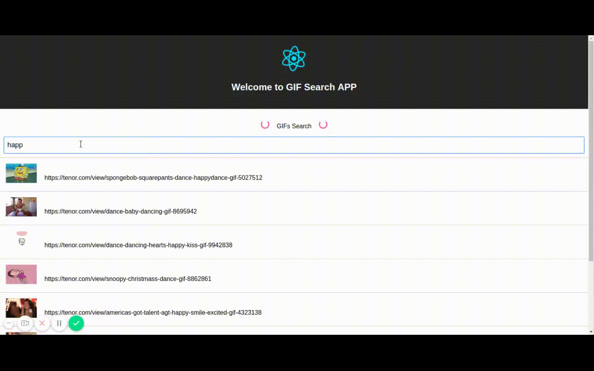

## React GIF Search

A simple gif search created with [Tenor](https://tenor.com/gifapi). This project is bootstraped with [Create React App](https://github.com/facebook/create-react-app).

## Preview

## To see how it's work
1)  Fork and star this repo**
2)  Clone this repo**
> $ git clone https://github.com/anujsinghwd/react-gif-search.git

3). Run the following command in your project directory**

> $ cd react-gif-search
> $ npm install
> $ npm run start

### Other Scripts

> $ npm run build -> minify the app for production

> $ npm run test -> to run the test cases

> $ npm run eject -> to eject this project to `cli` version

## Credits

[ReactJS](https://github.com/facebook/react)

[Create React App](https://github.com/facebook/create-react-app).

[Tenor](https://tenor.com/gifapi)
